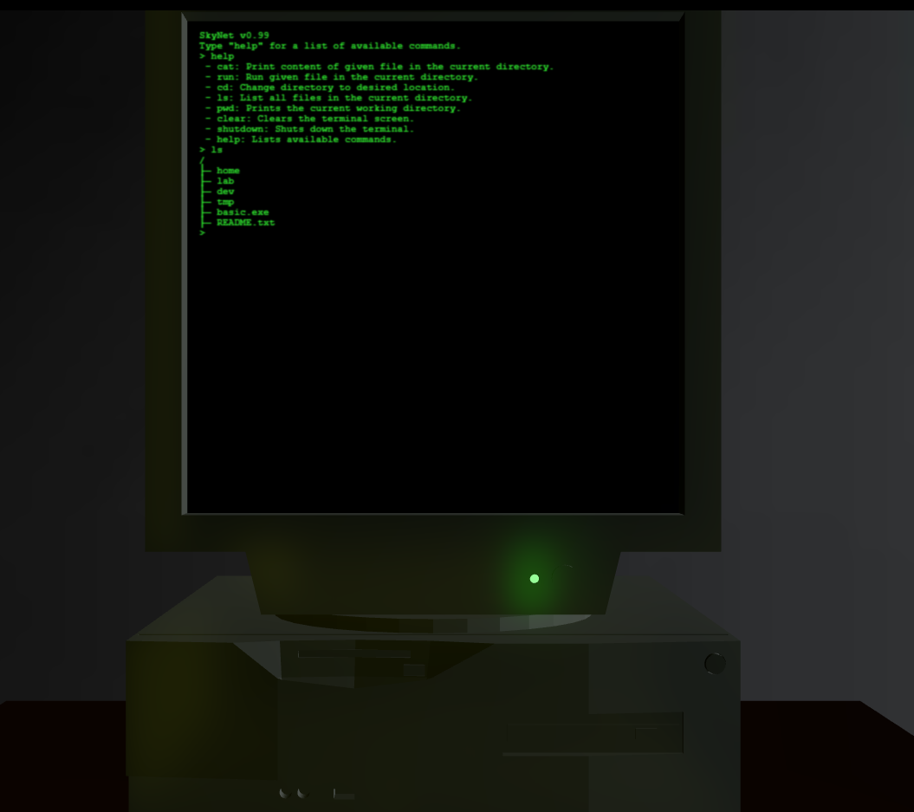

# terminal-quest

## Description
Terminal Quest is an interactive web application that simulates a retro computer terminal. The project utilizes HTML, CSS, and JavaScript to create an engaging user experience with a 3D model viewer and interactive elements.

## Preview

## Installation
- Clone this repository.
- Open "index.html".

## Features
- 3D Model Viewer: Displays a 3D model of an old PC using the <model-viewer> component.
- Interactive Environment: Users can interact with the model and toggle the computer power using a button.
- Modular JavaScript: The application is built with modular JavaScript, including files for filesystem operations, command handling, and main functionalities.

## Technologies Used
- HTML5: Structure of the web application.
- CSS3: Styling for the application.
- JavaScript: Functionality and interactivity.
- 3D Model Viewer: Utilizes the @google/model-viewer library for 3D model rendering.

## Known Issues
Does not work on mobile.  
GitHub preview seems to not load the model or the associated background image.